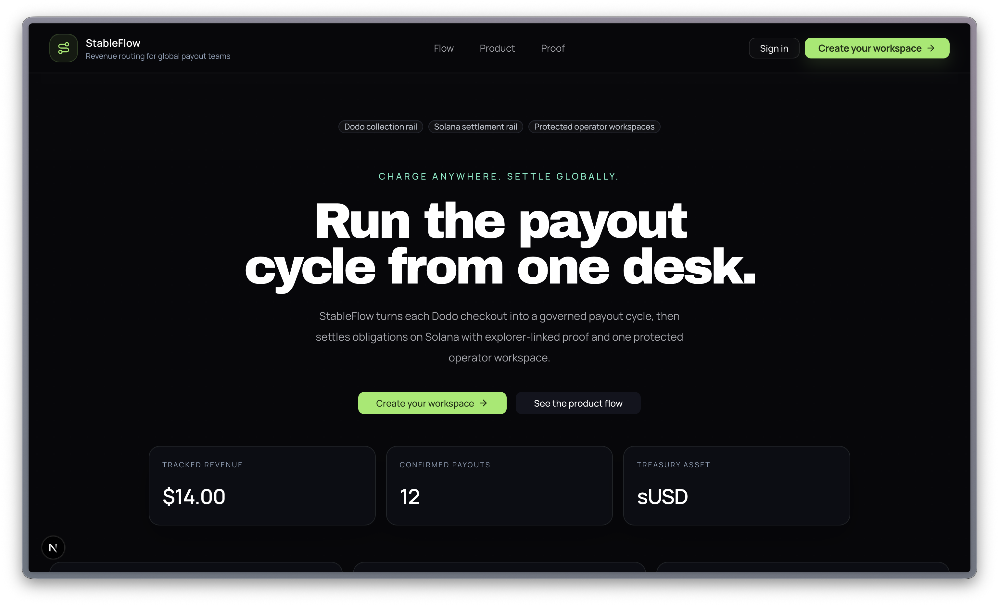
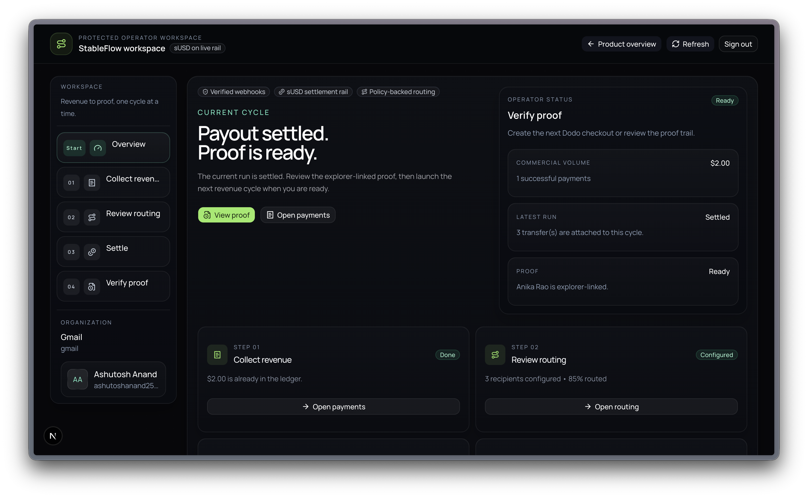
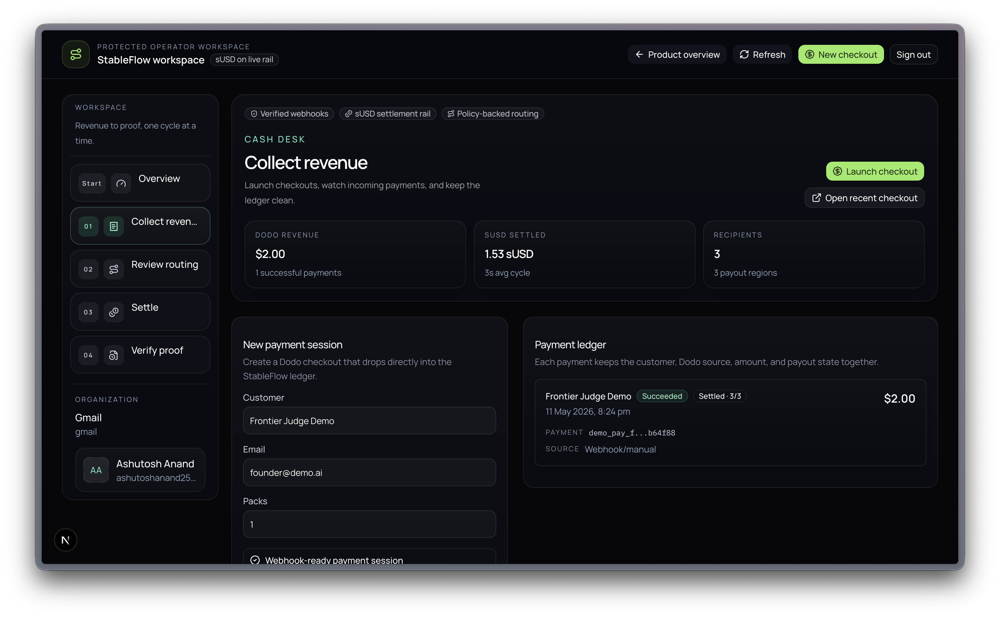
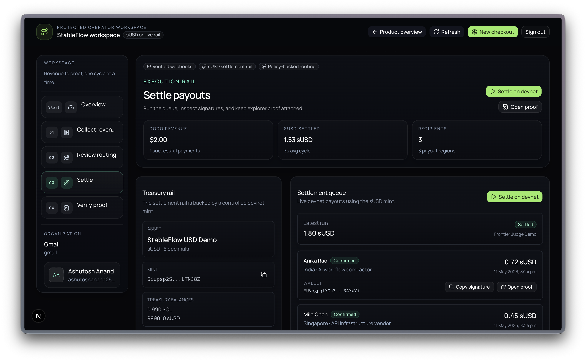
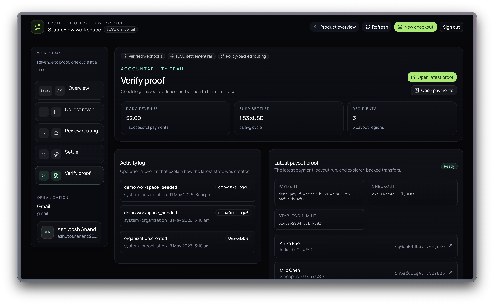

# StableFlow

[](https://nextjs.org/)
[](https://www.typescriptlang.org/)
[](https://dodopayments.com/)
[](https://solana.com/)

StableFlow is a Dodo-powered revenue routing product for global software teams. It turns customer payments into verified payout cycles, then settles recipient obligations as stablecoin transfers on Solana with proof, auditability, and a clean operator workspace.

## What StableFlow Does

Most global teams can collect revenue, but the moment money needs to fan out across contractors, affiliates, vendors, or agents, operations become slow and manual.

StableFlow fixes that flow:

1. Collect revenue through Dodo Payments
2. Verify signed webhook events and store them in a ledger
3. Apply payout policy and recipient routing
4. Settle obligations on Solana
5. Keep proof attached from checkout to payout

## Why This Matters

- Cross-border payout operations are still fragmented
- Teams often manage routing rules in spreadsheets
- Payment events and payout proof live in different tools
- Finance operators need one desk for revenue, routing, settlement, and auditability

StableFlow is built to make that operator flow obvious, structured, and programmable.

## Product Highlights

- Dodo checkout session creation tied to the StableFlow workspace
- Signed Dodo webhook verification with idempotent payment ingestion
- Supabase Postgres ledger for organizations, payments, recipients, policies, payout runs, transfers, and audit logs
- Policy-backed payout routing across multiple recipients
- Solana devnet settlement using a demo stablecoin treasury
- Proof-oriented workspace for revenue, routing, settlement, and explorer-linked signatures

## Screenshots

### Landing page



### Workspace overview



### Collect revenue



### Settle payouts



### Verify proof



## Tech Stack

- Next.js App Router
- TypeScript
- Prisma
- Supabase Postgres
- Firebase Auth
- Dodo Payments
- Solana web3.js
- shadcn/ui

## Local Setup

Create `.env.local` from `.env.example`, then fill the required Dodo, Supabase, Firebase, and Solana values.

```bash
npm install
npm run db:generate
npm run db:push
npm run dev
```

The local app runs at [http://localhost:3001](http://localhost:3001).

## Core Routes

- `GET /` product landing page
- `GET /sign-in` operator sign-in
- `GET /sign-up` operator sign-up
- `GET /workspace` protected operator workspace
- `POST /api/checkout` create a Dodo checkout session and ledger record
- `GET /api/dashboard` return the live workspace snapshot
- `GET /api/health` return the operational health snapshot
- `POST /api/webhooks/dodo` verify Dodo webhook signatures and create payout runs
- `POST /api/demo/seed` seed a demo organization, policy, payments, and payout run
- `POST /api/payouts/simulate` execute the latest payout run on Solana devnet

## Live Deployment

- Product overview: [stableflow-frontier.vercel.app](https://stableflow-frontier.vercel.app)
- Workspace: [stableflow-frontier.vercel.app/workspace](https://stableflow-frontier.vercel.app/workspace)
- Health: [stableflow-frontier.vercel.app/api/health](https://stableflow-frontier.vercel.app/api/health)

## Demo Stablecoin

- Asset: `StableFlow USD Demo (sUSD)`
- Mint: `5iupsp2SQHETtJAyrqKbxwPuLn9me1Zh4jmqspLTNJ8Z`
- Decimals: `6`
- Treasury wallet: `5ykZEE69NaDU9SfoK53MjbQ4g7Rawx1jqZtQFf6eAFfZ`

## Key Docs

- [Architecture](docs/ARCHITECTURE.md)
- [Proof Pack](docs/PROOF_PACK.md)

## Status

StableFlow is a polished hackathon build with:

- real Dodo payment flow integration
- signed webhook verification
- real database-backed routing records
- Solana devnet settlement proof
- a structured operator workspace for payments, routing, settlements, and proof
