# StableFlow Architecture

StableFlow is designed as a revenue-to-settlement pipeline for internet businesses.

## High-Level Flow

```mermaid
flowchart LR
  A["Customer"] --> B["StableFlow UI"]
  B --> C["POST /api/checkout"]
  C --> D["Dodo Checkout Sessions API"]
  D --> E["Hosted Dodo Checkout"]
  E --> F["Dodo payment event"]
  F --> G["POST /api/webhooks/dodo"]
  G --> H["Webhook verification + idempotency"]
  H --> I["Supabase Postgres ledger"]
  I --> J["Payout policy compiler"]
  J --> K["Payout run + queued transfers"]
  K --> L["Settlement executor"]
  L --> M["Solana devnet stablecoin transfers"]
  M --> N["Explorer links + dashboard proof"]
```

## Main Components

### 1. Checkout Ingestion

- `src/app/api/checkout/route.ts`
- `src/lib/dodo.ts`

The server creates a Dodo checkout session using the configured Dodo product. Metadata tags the request so the downstream webhook can be linked back to the StableFlow ledger.

### 2. Webhook Verification and Recording

- `src/app/api/webhooks/dodo/route.ts`
- `src/lib/ledger.ts`

The webhook layer:

- reads raw request body
- verifies Standard Webhooks headers
- stores unique `webhook-id` values
- marks duplicates idempotently
- creates or updates the payment record
- creates a payout run from policy rules

### 3. Ledger and Policy Engine

- `prisma/schema.prisma`
- `src/lib/ledger.ts`

The Postgres model tracks:

- organizations
- Dodo checkout sessions
- webhook events
- payments
- recipients
- payout policies
- payout rules
- payout runs
- payout transfers
- audit logs

This is the product core, because financial operations need relational consistency and traceability.

### 4. Settlement Queue

- `src/app/api/payouts/simulate/route.ts`
- `src/lib/solana.ts`

The settlement executor drains queued transfers and sends stablecoin payouts on Solana devnet. Each transfer stores:

- mint
- recipient wallet
- signature
- status
- timestamps
- explorer URL

## Why The Queue Is Explicit

StableFlow separates revenue verification from settlement execution on purpose.

That gives us:

- cleaner idempotency
- safer retry semantics
- a visible queue for operator review
- a path to background workers later

For the hackathon build, this makes the product easier to reason about and demo honestly.

## Security and Reliability Choices

- signed Dodo webhook verification
- idempotent processing keyed by `webhook-id`
- database-backed ledger instead of in-memory state
- explicit payout run states: `READY`, `EXECUTING`, `SETTLED`, `PARTIAL`, `FAILED`
- explorer-linked transfer proofs for settlement visibility

## Solana Rail

Current settlement rail:

- network: devnet
- asset: `StableFlow USD Demo (sUSD)`
- mint: `5iupsp2SQHETtJAyrqKbxwPuLn9me1Zh4jmqspLTNJ8Z`
- treasury wallet: `5ykZEE69NaDU9SfoK53MjbQ4g7Rawx1jqZtQFf6eAFfZ`

## Why This Architecture Matches The Track

- Dodo drives the real-world revenue event
- Solana handles the stablecoin settlement edge
- the app solves a business workflow, not just a wallet interaction
- the system can grow into contractor payouts, affiliate payouts, AI vendor payouts, and agentic micropayment flows

## Production Roadmap

After the hackathon, the next production steps are:

1. background job execution for payout runs
2. auth and multi-tenant org controls
3. approvals, thresholds, and payout windows
4. compliance and recipient verification
5. mainnet pilot with selected businesses
